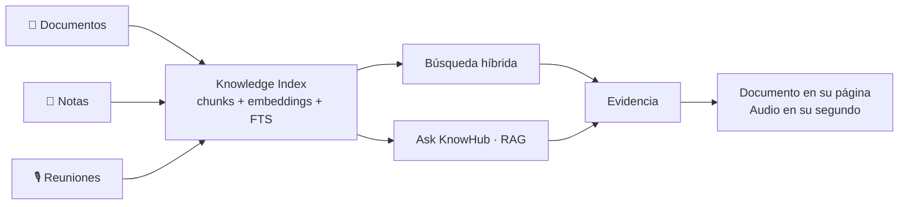
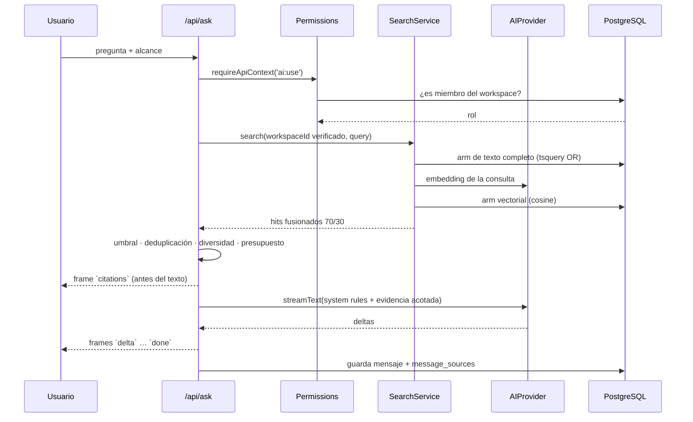
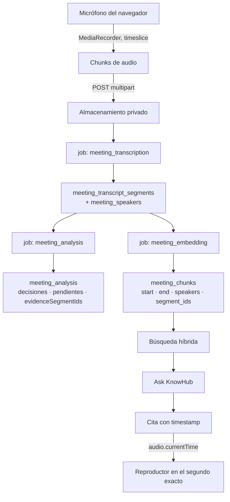

# Architecture

## The shape of the product

Everything KnowHub does is one loop:

```
CAPTURE → UNDERSTAND → RECALL → VERIFY
```

Three sources feed one index, and one index feeds every way of getting the
knowledge back out.



The last arrow is the product. An answer that cannot be checked is not a feature.

## Runtime

Modular monolith on Next.js 16 (App Router). No services, no broker, no queue
daemon — a single deployable plus a PostgreSQL database.

```
┌─────────────────────────────────────────────────────────┐
│ Next.js                                                 │
│                                                         │
│  Server Components ──┐                                  │
│  Server Actions ─────┼──→ src/server/*  ──→ PostgreSQL  │
│  Route Handlers ─────┘         │              + pgvector│
│    (uploads, streaming,        │                        │
│     signed URLs)               ├──→ StorageProvider     │
│                                ├──→ AIProvider          │
│  Client Components             └──→ TranscriptionProvider│
│    (recorder, player, forms)                            │
└─────────────────────────────────────────────────────────┘
```

### Why a monolith

Every "service" boundary that mattered here is a *provider interface*, not a
network hop: storage, AI, transcription and billing. Those are the parts that
change per deployment. Splitting the application itself would add operational
cost and buy nothing.

## Layers

| Layer | Location | Rule |
| --- | --- | --- |
| Routes | `src/app` | Resolve the session, call a service, render. No business logic. |
| Features | `src/features` | Client-side modules. `MediaRecorder` lives here and nowhere else. |
| Components | `src/components` | `ui/` primitives, `shared/` composed. No data access. |
| Services | `src/server/<domain>` | All business logic and every database query. |
| Providers | `src/server/{storage,ai,transcription}` | Interface + adapters + local implementation. |
| Config | `src/config` | Env validation, plan limits, retrieval tuning. |
| Lib | `src/lib` | Pure functions. No imports from `server/`. |

A Client Component may never import from `src/server`. `assertServerOnly()`
makes that failure loud instead of silent.

## Request flow: asking a question



Citations are streamed **before** the answer so the sources are on screen while
the text is still being written. That is what makes them read as evidence rather
than as a footnote.

## Meeting pipeline



Each stage owns a status column, so the UI reports what is actually happening and
a failure is contained:

| Stage fails | What the user still has |
| --- | --- |
| Transcription | The audio, playable, and a retry button. Nothing is deleted. |
| Analysis | The full transcript with timestamps, and a "volver a analizar". |
| Embeddings | The meeting, playable and readable; only smart search is missing. |

## Background jobs

`ai_jobs` is the queue. A job is claimed with a conditional `UPDATE ... WHERE
status = 'pending'`, so two runners cannot take the same row. Work is started
through Next's `after()`, which keeps the invocation alive past the response —
a bare floating promise would be killed and the job would sit at `pending`.

Retries are bounded and only for transient failures. A rejected file format fails
the same way on every attempt, so it is marked failed immediately.

Re-running any stage replaces its output inside a transaction: retrying can never
produce a duplicated transcript or a doubled set of chunks.

## Database access

One schema, two drivers:

- `DATABASE_URL` set → `node-postgres`
- unset → **PGlite**, PostgreSQL compiled to WASM, with pgvector

PGlite is not a test double. It runs the same migrations and the same SQL,
including `tsvector`, generated columns, `hnsw` indexes and check constraints.
That is what makes "works on my machine with no credentials" and "works in
production" the same code path.

## Client boundaries

`MediaRecorder` is a browser detail, deliberately isolated in
`src/features/meetings/recording/`. The state machine beneath it is a pure
reducer with no DOM dependency, which is why the whole recording lifecycle —
including permission denial and interruption — is unit-tested without hardware.

The server side of meetings (`MeetingService`, `TranscriptionProvider`,
`StorageProvider`, analysis, indexing) knows nothing about the browser, so a
future Expo/React Native client can reuse all of it by posting audio to the same
route.

## Extension points

| To change | Implement | Register |
| --- | --- | --- |
| Where files live | `StorageProvider` | `src/server/storage/index.ts` |
| Which model answers | `AIProvider` | `src/server/ai/index.ts` |
| Who transcribes | `TranscriptionProvider` | `src/server/transcription/index.ts` |
| A new file format | `DocumentParser` | `src/server/documents/parsers/index.ts` |
| A new async stage | `JobHandler` | `src/server/jobs/register.ts` |
