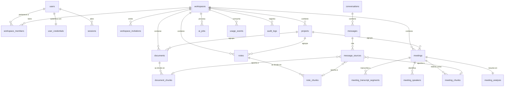

# Database

PostgreSQL 15+ with the `vector` extension. One schema
(`src/server/db/schema.ts`), one set of migrations
(`src/server/db/migrations/`), applied identically to managed Postgres and to the
embedded PGlite instance.

## Entity relationships



## Design decisions

### `workspace_id` on every tenant row

Even where it is derivable through a join. One predicate then isolates a tenant
in a query *and* in an RLS policy, and a chunk table can be filtered without
joining back to its parent. It is denormalised on purpose.

### Soft delete by default

User-visible resources carry `deleted_at`. Deleting a meeting from the UI hides
it; the audio and transcript survive. A separate, explicit purge
(`purgeMeeting`) removes the storage object and every derived row — that is the
only path that destroys data.

### Status columns instead of enums

`processing_status`, `transcription_status`, `analysis_status`,
`embedding_status` are `text` with `CHECK` constraints. Adding a state is a
one-line migration instead of an `ALTER TYPE` dance.

Each pipeline stage has its own column, which is what lets the UI say "la
transcripción está lista, pero no pudimos generar el análisis" instead of a
single opaque "failed".

### Timestamps survive chunking

`meeting_chunks` stores `start_seconds`, `end_seconds`, `speaker_keys` and
`segment_ids`. A retrieved chunk therefore knows exactly which moment of the
audio it came from, which is what makes a citation seekable rather than
approximate.

### Typed polymorphic citations

`message_sources` has three nullable foreign keys and a check constraint that
exactly one is set:

```sql
CONSTRAINT message_sources_exactly_one_check CHECK (
  (CASE WHEN document_chunk_id IS NOT NULL THEN 1 ELSE 0 END)
+ (CASE WHEN note_chunk_id     IS NOT NULL THEN 1 ELSE 0 END)
+ (CASE WHEN meeting_chunk_id  IS NOT NULL THEN 1 ELSE 0 END) = 1
)
```

A generic `(resource_type, resource_id)` pair would have been shorter and would
have lost referential integrity: with real foreign keys, deleting the evidence
deletes the citation instead of leaving it dangling.

### Speaker mapping is not the transcript

`meeting_transcript_segments.speaker_key` holds what the provider emitted
(`SPEAKER_00`). `meeting_speakers.display_name` holds what the user called them
("Santiago"). Renaming touches only the mapping, so it is reversible and the
original stays intact. Re-processing a meeting preserves existing names.

### Manual corrections are additive

`edited_text` sits beside `text`. The UI shows the correction; the original stays
in the row, and the audio remains the source of truth.

## Indexes

| Index | Purpose |
| --- | --- |
| `*_chunks_fts_idx` (GIN on `search_vector`) | Full-text arm of hybrid search |
| `*_chunks_embedding_idx` (HNSW, cosine) | Vector arm |
| `*_workspace_idx` on `(workspace_id, deleted_at)` | Tenant-scoped listing |
| `*_unique` on `(parent_id, chunk_index)` | Makes re-indexing idempotent |
| `ai_jobs_status_idx` on `(status, created_at)` | Queue claim |

The HNSW indexes are created inside an exception handler: the available access
method depends on the pgvector build, and retrieval still works (more slowly) via
exact scan, so a missing method must not fail a migration.

## Full-text search

`search_vector` is a `STORED` generated column:

```sql
to_tsvector('spanish', coalesce(content, ''))
```

The `spanish` configuration removes stopwords and stems. That matters: with
`simple`, the question "¿Qué decidimos sobre el proveedor?" either fails
entirely (all terms ANDed, and "decidimos" never appears literally) or matches
anything containing "de". With `spanish` it reduces to `{decid, proveedor}` and
matches the sentence that answers it.

Postgres applies one configuration per column, so predominantly English content
is stemmed by the Spanish stemmer. For a Spanish-first product that is the right
trade; per-language columns are the next step if it stops being one.

## Vectors

`vector(1536)`, matching `text-embedding-3-small`. The width is fixed at
migration time, so `embedTexts()` fails loudly if a provider returns a different
size rather than silently truncating. Changing `EMBEDDING_DIMENSIONS` requires a
migration and a re-embed.

## Migrations

TypeScript modules, not loose `.sql` files, so they are bundled with the server
build and run identically in every environment. They execute on first database
access and record themselves in `__knowhub_migrations`.

| Migration | Contents |
| --- | --- |
| `0000_init` | All tables, constraints, indexes, FTS columns |
| `0001_vector_indexes` | HNSW indexes, tolerant of an older pgvector |
| `0002_rls` | Row Level Security — **PostgreSQL only**, skipped on PGlite |
| `0003_spanish_fts` | Regenerates `search_vector` with the `spanish` config |

Append a new module; never edit an applied one.
`tests/integration/schema.test.ts` asserts that every column the Drizzle schema
declares actually exists in the migrated database, which is what keeps the
hand-written SQL honest.
