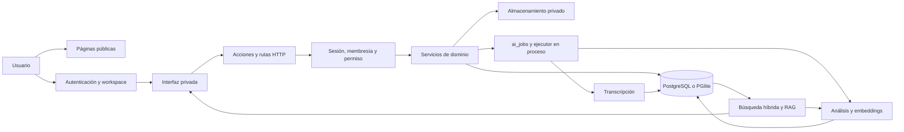

# KnowHub: arquitectura y funcionalidades observadas

Fecha de inspección: 8 de septiembre de 2026. Revisión base: `aa18d022367c55c903f6caa8e9b90b485217829f`.

Este informe deriva de la lectura del repositorio. **No constituye una certificación de producción ni registra pruebas ejecutadas por su autor.** Las referencias `archivo:línea` identifican evidencia en la revisión base. Los resultados actuales de instalación, compilación y pruebas deben incorporarse al informe maestro de validación. Las cifras y afirmaciones históricas de `CHECKPOINT.md` no se trasladan como resultados actuales.

Se leyeron primero `CLAUDE.md`, `CHECKPOINT.md` y `.specify/constitution.md`. No se modificaron código, configuración ni especificaciones existentes. Este documento es un insumo de descubrimiento para el documento académico y la preparación de la landing.

## 1. Conclusión de arquitectura

KnowHub es un **monolito modular de conocimiento personal y de equipos**. Una misma aplicación Next.js presenta páginas públicas, autenticación y un espacio privado que reúne documentos, notas y reuniones. El servidor extrae o recibe texto, lo divide en fragmentos, produce representaciones vectoriales y permite recuperar fuentes para responder preguntas. La reunión es el recorrido más distintivo: audio o transcripción → segmentos → análisis → búsqueda → respuesta con enlaces al instante de la fuente.

La intención de trazabilidad está representada en datos, prompts e interfaz, pero el código no garantiza que toda afirmación del modelo tenga evidencia válida. Esa diferencia debe quedar explícita en el SDD y en las promesas comerciales; véase la sección 8.

### Componentes y dependencias

| Capa | Responsabilidad observada | Evidencia |
| --- | --- | --- |
| Next.js / React | App Router, páginas de servidor, acciones de servidor y controladores HTTP | `package.json:42`, `package.json:44`, `src/server/auth/guard.ts:23`, `src/app/api/ask/route.ts:55` |
| Interfaz | TypeScript, Tailwind, primitivas Radix, iconos Lucide; módulos interactivos en `src/features/` | `package.json:30`, `package.json:40`, `package.json:64`, `package.json:66` |
| Servicios | Módulos de autenticación, permisos, workspaces, proyectos, biblioteca, documentos, notas, reuniones, conversaciones y búsqueda | `src/server/auth/service.ts:22`, `src/server/meetings/service.ts:34`, `src/server/search/index.ts:37` |
| Persistencia | Drizzle con un esquema; `pg` si existe `DATABASE_URL`, PGlite con pgvector si falta | `src/server/db/client.ts:34`, `src/server/db/client.ts:60`, `src/server/db/client.ts:92` |
| Procesamiento | Trabajos persistidos en `ai_jobs`, ejecutados dentro del proceso y ligados a `after()` cuando hay petición Next | `src/server/jobs/index.ts:49`, `src/server/jobs/index.ts:93`, `src/server/jobs/index.ts:123` |
| Proveedores | Adaptadores de IA, transcripción y almacenamiento con selección por configuración | `src/server/ai/index.ts:22`, `src/server/transcription/index.ts:14`, `src/server/storage/index.ts:15` |
| Validación | Esquemas Zod en límites HTTP y resultados estructurados | `src/app/api/ask/route.ts:31`, `src/server/ai/openai.ts:135`, `src/validations/meeting-analysis.ts:47` |

`package.json` declara rangos, no las versiones efectivamente instaladas. Declara pnpm 11.5.3 y Node >=20.11; las versiones resueltas y su compatibilidad corresponden a la validación actual (`package.json:6`). No se identificó un backend desplegable separado, broker de mensajes ni SDK Stripe en las dependencias declaradas.

El diagrama resume responsabilidades del código; no representa una infraestructura de producción inspeccionada.

## 2. Modelo de información

| Grupo | Entidades principales | Relación y datos relevantes | Evidencia |
| --- | --- | --- | --- |
| Identidad | `users`, `user_credentials`, `sessions` | Credenciales separadas; hash de contraseña, hash de token y vencimientos | `src/server/db/schema.ts:41`, `src/server/db/schema.ts:64`, `src/server/db/schema.ts:75` |
| Tenencia | `workspaces`, `workspace_members`, `workspace_invitations` | Workspace con propietario, tipo y plan; membresías con roles; invitaciones con token hash | `src/server/db/schema.ts:98`, `src/server/db/schema.ts:121`, `src/server/db/schema.ts:141` |
| Organización | `projects` | Pertenece a workspace; documentos, notas y reuniones pueden asociarse a proyecto | `src/server/db/schema.ts:166`, `src/server/db/schema.ts:198`, `src/server/db/schema.ts:267`, `src/server/db/schema.ts:323` |
| Documentos | `documents`, `document_chunks` | Original, metadatos y estados; fragmentos con página y vector | `src/server/db/schema.ts:191`, `src/server/db/schema.ts:234` |
| Notas | `notes`, `note_chunks` | Contenido editable y fragmentos recuperables | `src/server/db/schema.ts:260`, `src/server/db/schema.ts:289` |
| Reuniones | `meetings`, `meeting_speakers`, `meeting_transcript_segments`, `meeting_chunks`, `meeting_analysis` | Fuente, audio, estados por etapa, hablantes, intervalos, análisis y referencias a segmentos | `src/server/db/schema.ts:316`, `src/server/db/schema.ts:373`, `src/server/db/schema.ts:390`, `src/server/db/schema.ts:416`, `src/server/db/schema.ts:442` |
| Conversaciones | `conversations`, `messages`, `message_sources` | Conversaciones por usuario y alcance; mensajes y citas a fragmentos | `src/server/db/schema.ts:471`, `src/server/db/schema.ts:499`, `src/server/db/schema.ts:524` |
| Operación | `ai_jobs`, `usage_events`, `audit_logs`, `rate_limits`, `analytics_events` | Trabajo pendiente, consumo, eventos y límites | `src/server/db/schema.ts:564`, `src/server/db/schema.ts:591`, `src/server/db/schema.ts:607`, `src/server/db/schema.ts:624`, `src/server/db/schema.ts:634` |

El esquema fija vectores de 1536 dimensiones (`src/server/db/schema.ts:32`). Cambiar modelo o dimensión exige preservar compatibilidad o regenerar embeddings; el ajuste de entorno por sí solo no modifica el esquema. Los recursos principales usan borrado lógico y las reuniones tienen una operación de purga explícita (`src/server/meetings/service.ts:325`, `src/server/meetings/service.ts:346`). No se deduce de esto que exista una política completa de retención o eliminación de cuenta.

Las migraciones se ejecutan al primer acceso a la base y registran un historial (`src/server/db/client.ts:99`, `src/server/db/migrate.ts:13`). La migración RLS se omite en PGlite y utiliza `auth.uid()` (`src/server/db/migrations/0002_rls.ts:2`, `src/server/db/migrations/0002_rls.ts:17`); por ello, no debe suponerse compatibilidad inmediata con cualquier PostgreSQL sin esa función.

## 3. Funcionalidades y recorridos

**Ingreso y organización.** El registro crea usuario, credencial, workspace personal y membresía OWNER en una transacción (`src/server/auth/service.ts:35`). El usuario inicia sesión, el servidor resuelve un workspace de sus membresías y presenta sus recursos (`src/server/auth/session.ts:114`). La biblioteca agrupa los tres tipos de contenido y los proyectos los organizan; las specs 0001 y 0002 documentan estos contratos.

**Documentos.** La carga valida archivo, proyecto y cuota; guarda el original privado y encola procesamiento (`src/app/api/documents/upload/route.ts:15`, `src/server/documents/index.ts:32`). Se extrae texto, fragmenta, resume e indexa (`src/server/documents/index.ts:113`, `src/server/documents/index.ts:197`). PDF preserva números de página y rechaza escaneos sin texto: **no existe OCR en ese parser** (`src/server/documents/parsers/pdf.ts:19`). Las rutas de parsers incluyen PDF, DOCX y texto; la spec 0003 cubre PDF/DOCX/MD/TXT.

**Notas.** Crear o modificar contenido programa indexación; cambiar únicamente metadatos no necesita regenerar los fragmentos (`src/server/notes/index.ts:21`, `src/server/notes/index.ts:49`). Las notas se pueden recuperar y citar junto a los demás recursos (`src/server/search/index.ts:164`).

**Reuniones.** Existen grabación, carga de audio e importación textual como fuentes (`src/server/db/schema.ts:314`). Adjuntar audio verifica acceso, tipo, tamaño y duración disponible antes de encolar transcripción (`src/server/meetings/service.ts:98`). Importar transcripción permite ingresar contenido real sin reconocimiento de voz (`src/server/meetings/service.ts:178`). Persistirla reemplaza segmentos y hablantes en una transacción y conserva nombres renombrados (`src/server/meetings/transcript.ts:15`). El análisis produce resumen, temas, participantes, decisiones, pendientes, puntos clave, preguntas abiertas y fechas (`src/server/meetings/pipeline.ts:122`). Los fragmentos conservan intervalos, hablantes e ids de segmentos (`src/server/meetings/pipeline.ts:195`).

**Búsqueda y preguntas.** Dos búsquedas combinan texto completo y similitud vectorial; los filtros de workspace se incluyen en SQL y el fallo de embeddings permite resultados textuales (`src/server/search/index.ts:37`, `src/server/search/index.ts:160`, `src/server/search/index.ts:222`). RAG limita y selecciona contexto; si no encuentra evidencia suficiente, devuelve un mensaje predefinido sin pedir respuesta al modelo (`src/server/ai/rag.ts:109`, `src/server/ai/rag.ts:197`). Los enlaces de reunión contienen `?t=`; documentos enlazan al fragmento, cuya etiqueta puede identificar página (`src/server/ai/rag.ts:78`).

**Degradación por etapas.** Un error del análisis conserva la transcripción y aún programa indexación (`src/server/meetings/pipeline.ts:161`). Un fallo de embeddings mantiene disponible la reunión (`src/server/meetings/pipeline.ts:247`). Esto describe el control de errores leído; su ejecución se verifica por separado.

## 4. Superficie de rutas y API

Las páginas públicas son `/`, `/privacy` y `/terms`. Autenticación utiliza `/login`, `/signup`, `/forgot-password` y `/reset-password`. El área privada contiene `/dashboard`, `/onboarding`, `/library`, `/projects`, `/projects/[projectId]`, `/documents/[documentId]`, `/notes/new`, `/notes/[noteId]`, `/meetings`, `/meetings/new`, `/meetings/[meetingId]`, `/search`, `/ask`, `/profile`, `/settings`, `/settings/members` e `/invitations/[token]`. Inventario obtenido de los archivos `page.tsx` bajo `src/app/`; no equivale a haber visitado cada pantalla.

| Método y ruta | Entrada / salida | Autorización observada | Evidencia |
| --- | --- | --- | --- |
| `POST /api/documents/upload` | Multipart `file`, `projectId` opcional y título; devuelve `documentId` | `content:create`, proyecto del workspace, límite de frecuencia y archivo | `src/app/api/documents/upload/route.ts:15` |
| `POST /api/meetings/[meetingId]/audio` | Multipart `audio`, duración opcional; devuelve `meetingId` | `meeting:record`, acceso resuelto desde reunión, límites | `src/app/api/meetings/[meetingId]/audio/route.ts:21` |
| `GET /api/meetings/[meetingId]/status` | Estados de reunión, transcripción, análisis y embeddings | Sesión y lectura de reunión | `src/app/api/meetings/[meetingId]/status/route.ts:15` |
| `POST /api/ask` | Pregunta, conversación opcional y alcance; stream NDJSON `status/citations/delta/done` o error | `ai:use`, cuotas, límite de frecuencia, recursos y conversación autorizados | `src/app/api/ask/route.ts:31`, `src/app/api/ask/route.ts:55`, `src/app/api/ask/route.ts:109` |
| `GET /api/storage/[...path]` | Objeto privado con firma y vencimiento en URL | La firma funciona como autorización temporal; no exige cookie propia | `src/app/api/storage/[...path]/route.ts:17` |
| `GET /api/health` | Estado y nombres de proveedores, 503 si falla acceso DB | Pública; prueba `SELECT 1` | `src/app/api/health/route.ts:8` |

Las demás mutaciones usan Server Actions en sus grupos de rutas. No se identificó una API pública versionada de integración ni endpoints de pago. `/api/health` confirma acceso a base de datos, **no realiza una llamada de prueba a IA, transcripción, almacenamiento remoto o Stripe**.

## 5. Proveedores: existente, simulado y pendiente

| Capacidad | Implementación local | Implementación externa | Límite de la evidencia |
| --- | --- | --- | --- |
| Base de datos | PGlite con extensión vectorial; persistencia configurable | Pool `pg` | Se leyó la selección, no se conectó una infraestructura externa |
| IA y embeddings | `MockAIProvider`; modo determinista de desarrollo | REST compatible con OpenAI: `/chat/completions`, `/embeddings` | Proveedor externo escrito; no probado con credenciales en esta inspección |
| Transcripción | **Guion ficticio fijo**, tiempos estimados según bytes; `isMock=true` | REST `/audio/transcriptions`, segmentos temporales | El mock no escucha ni transcribe el audio; el adaptador real declara `supportsDiarization=false` |
| Almacenamiento | Archivos fuera de `public/`, permisos 0600, URLs HMAC | Supabase Storage REST con bucket privado | Privado no significa cifrado en reposo por la aplicación |
| Autenticación | scrypt, sesión opaca y cookie httpOnly | `AUTH_PROVIDER=supabase` figura en configuración | No se identificó implementación de Supabase Auth conectada al flujo |
| Facturación | Planes y cuotas, sin cobro | Variables Stripe y etiqueta de estado | No se identificaron `BillingProvider`, checkout ni webhook funcional |
| Correo | Invitación mediante enlace; recuperación muestra enlace solo fuera de producción | No se identificó transporte | La recuperación en producción no tiene entrega del token implementada |

Evidencia: `src/server/ai/openai.ts:60`, `src/server/ai/openai.ts:93`, `src/server/ai/openai.ts:191`; `src/server/transcription/mock.ts:18`, `src/server/transcription/mock.ts:34`; `src/server/transcription/openai.ts:31`, `src/server/transcription/openai.ts:59`; `src/server/storage/local.ts:35`, `src/server/storage/local.ts:72`; `src/server/storage/supabase.ts:25`; `src/config/env.ts:35`, `src/config/env.ts:73`, `src/config/env.ts:122`; `src/app/(auth)/actions.ts:112`; `src/server/workspaces/index.ts:80`.

IA y transcripción tienen controles independientes: en producción el uso local exige `AI_PROVIDER=mock` y `TRANSCRIPTION_PROVIDER=mock` respectivamente (`src/server/ai/index.ts:32`, `src/server/transcription/index.ts:25`). No basta activar uno para habilitar el otro. Los modelos configurados por defecto son valores del código, no recomendaciones actualizadas de proveedor (`src/config/env.ts:51`, `src/config/env.ts:59`).

Los planes `free/pro/team` definen límites, deliberadamente sin precios (`src/config/plans.ts:1`). No se deben convertir sus valores en ofertas comerciales sin validar límites globales y flujo de contratación. Por ejemplo, el máximo global de audio por defecto es 200 MB, aunque Pro y Team declaren cuotas superiores (`src/config/env.ts:63`, `src/config/plans.ts:42`, `src/config/plans.ts:53`). El workspace se crea por defecto en Free, que admite un solo miembro; `inviteMember()` aplica ese límite (`src/server/db/schema.ts:105`, `src/config/plans.ts:32`, `src/server/workspaces/index.ts:95`). La colaboración está modelada y tiene servicios, pero un registro normal no obtiene por sí solo un workspace con plazas adicionales y no se localizó un flujo de compra para ampliarlo.

## 6. Permisos, privacidad y PWA

La frontera principal es el workspace. `requireWorkspaceAccess()` consulta membresía real y devuelve 404 al no-miembro; el permiso insuficiente de un miembro devuelve prohibición (`src/server/permissions/index.ts:33`). OWNER administra facturación y eliminación; ADMIN gestiona contenido y miembros; MEMBER crea y edita; VIEWER lee y busca, sin `ai:use` (`src/server/permissions/policy.ts:21`). Por tanto, no todos los miembros pueden preguntar a la IA.

Los guardas de páginas/API validan sesión y resuelven el workspace (`src/server/auth/guard.ts:23`, `src/server/auth/guard.ts:46`). Un workspace solicitado que no coincide puede resolverse al último o primer workspace propio (`src/server/auth/session.ts:136`); los llamadores deben usar el resultado verificado. Las funciones internas de procesamiento reciben ids desde trabajos confiables y algunas consultan por id sin volver a aplicar `workspace_id` (`src/server/jobs/register.ts:17`, `src/server/meetings/pipeline.ts:97`): el SDD debe describir esa frontera, evitando afirmar que literalmente toda consulta contiene un predicado de workspace.

Las sesiones guardan solo el hash del token y vencen a los 30 días; la cookie es httpOnly y SameSite=Lax (`src/server/auth/session.ts:12`, `src/server/auth/session.ts:33`). El contenido recuperado se coloca en un mensaje `user` delimitado y las reglas permanecen en `system` (`src/server/ai/prompts/index.ts:45`). Es una defensa estructural útil, no una prueba de inmunidad a inyección de prompts.

La PWA dispone de manifest con inicio en `/dashboard` y modo standalone, y declara expresamente que no promete offline (`src/app/manifest.ts:4`). La búsqueda de registro de service worker en `src/` y `public/` no encontró implementación. Además, la inspección de cabeceras de `public/icon-192.png` y `public/icon-512.png` confirmó imágenes de **1×1 píxel**, aunque el manifest declara 192×192 y 512×512 (`src/app/manifest.ts:18`). Instalación y comportamiento en dispositivos requieren validación actual.

## 7. Matriz funcional y trazabilidad inicial

Todos los elementos con código siguiente tienen estado **Leído; ejecución actual pendiente en este informe**. «Prueba existente» significa archivo inspeccionado o localizado, no resultado aprobado.

| ID de descubrimiento | Contrato relacionado | Evidencia de implementación | Prueba existente o comprobación pendiente | Estado / límite |
| --- | --- | --- | --- | --- |
| F01 | Spec 0001 R1–R3: registro, workspace y sesión | `src/server/auth/service.ts:22`, `src/server/auth/session.ts:33` | `tests/integration/auth.test.ts` | Leído; flujo de navegador pendiente |
| F02 | Spec 0001 R4: recuperar acceso | `src/app/(auth)/actions.ts:112` | `tests/integration/auth.test.ts:103` | Parcial: token, sin correo de producción |
| F03 | Spec 0001 R5: aislamiento | `src/server/permissions/index.ts:33`, `src/server/search/index.ts:160` | `tests/integration/tenant-isolation.test.ts:44`, `e2e/meetings.spec.ts:104` | Leído; RLS externo no cubierto por suite PGlite |
| F04 | Spec 0001 R6–R8: espacios y miembros | `src/server/workspaces/index.ts:20`, `src/server/workspaces/index.ts:85` | `tests/unit/permissions.test.ts`; recorrido invitaciones pendiente | Leído; restricciones de invitación por revisar |
| F05 | Spec 0002: biblioteca y proyectos | `src/server/library/index.ts:45`, `src/server/projects/index.ts:18` | `tests/integration/knowledge-pipeline.test.ts:138` | Leído; interacción pendiente |
| F06 | Spec 0003: documentos | `src/server/documents/index.ts:32`, `src/server/documents/index.ts:113` | `tests/integration/knowledge-pipeline.test.ts:32`, `e2e/knowledge.spec.ts` | Leído; OCR ausente |
| F07 | Spec 0004: notas e indexación | `src/server/notes/index.ts:21`, `src/server/notes/index.ts:49` | `tests/integration/knowledge-pipeline.test.ts:94` | Leído; autoguardado visual pendiente |
| F08 | Spec 0005: audio y texto importado | `src/server/meetings/service.ts:98`, `src/server/meetings/service.ts:178` | `tests/unit/recorder-machine.test.ts`, `tests/unit/transcript-parsing.test.ts` | Leído; hardware de micrófono no cubierto por máquina de estados |
| F09 | Spec 0006 R1/R7: transcripción y hablantes | `src/server/transcription/openai.ts:31`, `src/server/transcription/mock.ts:34` | `tests/integration/meeting-pipeline.test.ts` | Leído; prueba local no valida reconocimiento de voz real |
| F10 | Spec 0006: análisis y evidencia | `src/server/meetings/pipeline.ts:95`, `src/validations/meeting-analysis.ts:77` | `tests/unit/meeting-analysis-schema.test.ts` | Leído; permite resultados sin ids de evidencia |
| F11 | Spec 0007: búsqueda, RAG y citas | `src/server/search/index.ts:37`, `src/server/ai/rag.ts:141` | `tests/integration/knowledge-pipeline.test.ts:179`, `tests/unit/search-scoring.test.ts` | Leído; fidelidad del modelo externo pendiente |
| F12 | Spec 0008: procesamiento y reintentos | `src/server/jobs/index.ts:123`, `src/server/jobs/index.ts:189` | `tests/integration/meeting-failures.test.ts`, `tests/integration/meeting-pipeline.test.ts` | Leído; recuperación automática de huérfanos en despliegue pendiente |
| F13 | Configuración de planes | `src/config/plans.ts:22`, `src/server/usage/index.ts:55` | `tests/unit/plans.test.ts` | Cuotas leídas; pagos ausentes |
| F14 | Manifest PWA | `src/app/manifest.ts:5` | Inspección de manifest/iconos; instalación pendiente | Parcial; sin offline, iconos incorrectos |

Las specs 0001–0008 se declaran retroactivas y no tienen plan/tareas históricos reconstruidos (`specs/README.md:44`). Aquí **SDD del repositorio significa Spec-Driven Development**, mientras que el documento académico pedido es un **Software Design Document**. Son complementarios. Un documento académico honesto puede enlazar las specs y describir las decisiones observadas, sin presentar como previa una planificación que no consta.

La suite Vitest configura PGlite en memoria y proveedores mock, y elimina claves externas (`tests/setup.ts:9`). Playwright configura Chromium, proveedores mock y carga de WAV, sin prueba de micrófono real (`playwright.config.ts:9`, `playwright.config.ts:28`, `playwright.config.ts:35`). Los tests de seguridad de prompts comprueban estructura y respuestas locales (`tests/integration/prompt-safety.test.ts:29`), no la resistencia empírica de un modelo externo. Ninguno de esos resultados históricos sustituye validación actual.

## 8. Brechas que condicionan el SDD, el copy y la integración

Son hallazgos de lectura o riesgos deducidos del flujo; no se explotaron ni reprodujeron en ejecución durante esta inspección.

| Prioridad de revisión | Hallazgo y evidencia | Implicación / siguiente paso |
| --- | --- | --- |
| Alta: promesa central | `evidenceSegmentIds` admite vacío; la poda elimina ids inválidos pero conserva la afirmación (`src/validations/meeting-analysis.ts:12`, `src/validations/meeting-analysis.ts:81`). El análisis se guarda después (`src/server/meetings/pipeline.ts:120`). | Definir un contrato verificable para afirmaciones sin respaldo. Hasta entonces no prometer «toda afirmación verificada» o «cero alucinaciones». |
| Alta: respuestas | Si el modelo no cita o cita números inexistentes, se muestran las fuentes recuperadas en lugar de rechazar la respuesta (`src/server/ai/rag.ts:218`). | Fuentes enlazadas no prueban que cada frase esté sustentada. Incluir evaluación específica de fidelidad y rechazo. |
| Alta: invitaciones | Aceptar comprueba token/vencimiento, pero no compara el correo del usuario con `invitation.email` (`src/server/workspaces/index.ts:125`); la página pasa solo `user.id` (`src/app/(dashboard)/invitations/[token]/page.tsx:22`). | Un enlace actúa como portador de acceso para cualquier usuario autenticado que lo obtenga. Aclarar si ese es el contrato y revisar antes de abrir equipos externos. |
| Alta: privacidad | Almacenamiento local escribe bytes tal cual, con permisos 0600 (`src/server/storage/local.ts:39`); el servidor registra hasta 500 caracteres del error del proveedor (`src/server/ai/openai.ts:85`, `src/server/transcription/openai.ts:74`). | No anunciar cifrado en reposo por la aplicación ni ausencia absoluta de contenido en logs. Revisar protección del entorno y saneamiento de errores. |
| Alta: DB externa | TLS remoto usa `rejectUnauthorized:false` (`src/server/db/client.ts:41`) y RLS depende de `auth.uid()` (`src/server/db/migrations/0002_rls.ts:17`). | Verificar certificados, usuario DB y migraciones con el proveedor elegido. No declarar endurecimiento de producción ya resuelto. |
| Alta: recuperación | El token solo se devuelve fuera de producción y no hay transporte de correo (`src/app/(auth)/actions.ts:121`, `src/server/auth/service.ts:123`). | Configurar entrega real antes de considerar completo el proceso público de recuperación. |
| Media: procesamiento durable | Reintentos y liberación de huérfanos viven en `processPendingJobs`; no se identificó un disparador periódico en la aplicación (`src/server/jobs/index.ts:189`, `src/server/jobs/index.ts:221`, `src/server/jobs/register.ts:13`). La deduplicación de encolado es consulta seguida de inserción (`src/server/jobs/index.ts:57`). | Probar reinicio del servidor, reintento transitorio y concurrencia. El claim atómico protege un mismo job, no demuestra por sí solo ausencia de dos jobs equivalentes. |
| Media: reemplazo de audio | Se elimina el objeto anterior antes de subir y persistir el nuevo (`src/server/meetings/service.ts:129`). | Un fallo de subida puede dejar el registro apuntando al original ya borrado. Revisar secuencia de reemplazo antes de prometer conservación ante cualquier fallo. |
| Media: streaming de audio | La ruta declara `Accept-Ranges: bytes`, pero devuelve el archivo completo y no procesa `Range` (`src/app/api/storage/[...path]/route.ts:45`). | Medir reproducción y búsqueda temporal de archivos grandes; no asumir streaming parcial implementado. |
| Media: consumo | El almacenamiento agregado suma documentos, no audio (`src/server/usage/index.ts:67`), y la duración cargada puede ser desconocida o provista por cliente (`src/server/meetings/service.ts:118`). | No publicar cuotas como facturación precisa hasta comprobar conteo, límites y concurrencia. |
| Media: pagos / estado | `billing` se marca Stripe por mera presencia de una clave (`src/config/env.ts:122`), sin integración localizada. | No usar ese indicador como comprobación de pagos activos ni incluir «contrata Pro» sin flujo real. |
| Media: instalación | Iconos PNG 1×1 y sin service worker; manifest indica sin offline (`src/app/manifest.ts:4`). | Corregir assets y verificar dispositivos antes de promocionar instalación; excluir promesa offline. |

## 9. Condiciones de integración de la landing

La ubicación natural para la implementación es el grupo público existente `src/app/(marketing)/`, conservando autenticación, dashboard y controladores. Antes de implementarla, el plan debe concretar rutas modificadas, componentes reutilizados, alcance de estilos y validaciones de regresión. La landing no necesita tocar esquema, permisos, proveedores o pipeline para presentar el producto.

El CTA debe apuntar a un recorrido existente y comprobado. Una demostración de respuesta → cita → audio debe usar contenido de ejemplo claramente identificado y una interacción real o una recreación declarada. Los assets de Higgsfield pueden aportar atmósfera y transiciones; no deben representar cifras, integraciones, precisión, clientes ni resultados inexistentes.

Para validar la integración: conservar el acceso por `/login` y `/signup`, comprobar navegación a la aplicación, revisar estilos compartidos, limitar descarga automática de video, ofrecer poster y movimiento reducido, y ejecutar los controles existentes con evidencia actual. No incluir en el trabajo de landing correcciones de backend sin su propia especificación y alcance: las brechas anteriores deben entrar en el registro de decisiones y preparación de producción.
