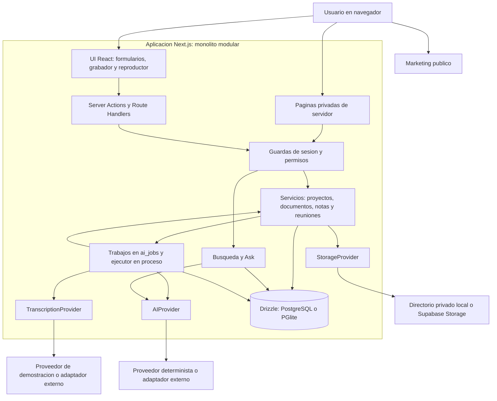
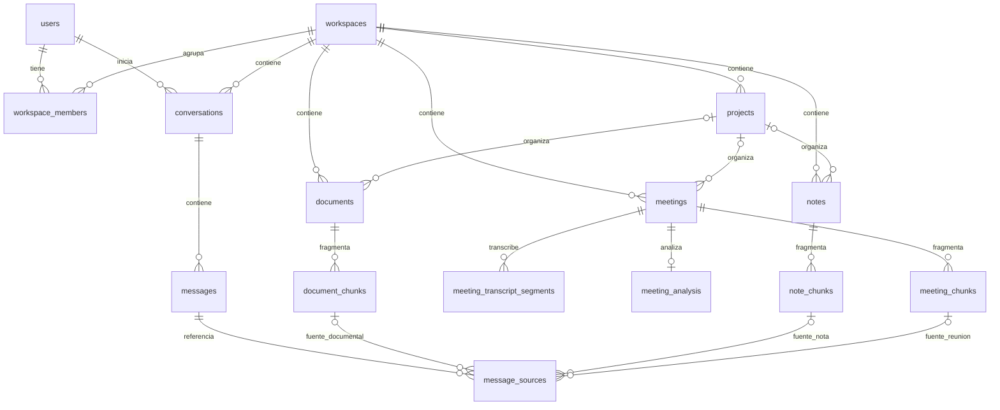
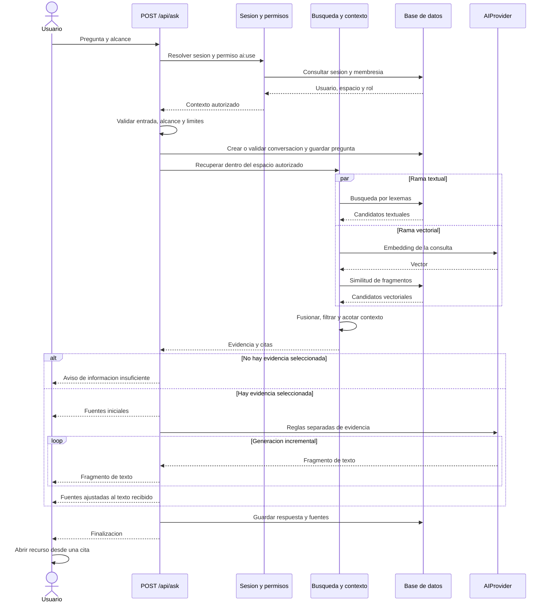

# KnowHub — propuesta de Software Design Document académico

**Versión:** 0.1 · **Fecha de análisis:** 8 de septiembre de 2026  
**Base examinada:** [`santybenawr/knowhub`, commit `aa18d022367c55c903f6caa8e9b90b485217829f`](https://github.com/santybenawr/knowhub/tree/aa18d022367c55c903f6caa8e9b90b485217829f)  
**Tipo de entrega:** propuesta desarrollada de documento de diseño; ingeniería inversa del software existente y plan de verificación.  
**Datos académicos por completar:** autor o equipo, institución, asignatura, docente y rúbrica de evaluación.

## 1. Propósito, método y alcance de la evidencia

Este documento explica cómo está diseñado KnowHub y conecta sus capacidades con módulos, datos y pruebas que pueden inspeccionarse. Está destinado a un lector académico que necesita comprender el sistema y evaluar si las decisiones técnicas corresponden al problema planteado. No pretende reconstruir retrospectivamente una planificación que no quedó registrada ni certificar la preparación del producto para producción.

La revisión parte del código, contrasta `CLAUDE.md`, `CHECKPOINT.md`, `.specify/constitution.md`, `specs/README.md` y documentación de arquitectura, y lee selectivamente implementaciones y pruebas. Las referencias `archivo:líneas` corresponden al commit indicado. El prefijo de las rutas es la raíz del repositorio.

**Dos significados de SDD deben quedar separados en la sustentación:**

| Término | Qué representa en este proyecto |
| --- | --- |
| **Software Design Document** | El entregable académico: descripción organizada de arquitectura, requisitos, componentes, interfaces, datos, comportamiento, decisiones y verificación. Este archivo prepara ese documento. |
| **Spec-Driven Development** | El método de trabajo ya establecido en el repositorio: especificación → plan → tareas → implementación. `specs/README.md:7–23` describe sus etapas. |

Las especificaciones 0001–0008 son **retroactivas**, según `specs/README.md:44–63`. Documentan el contrato del MVP existente; deliberadamente no contienen planes ni listas de tareas escritos como si hubieran precedido a su construcción. La nueva landing corresponde a una evolución futura que debe tener su propia especificación, plan y tareas. Documentar el diseño real ahora es válido; afirmar que toda la aplicación nació siguiendo esa secuencia no está sustentado por este repositorio.

Se emplean estas categorías:

- **L — Leído:** existe implementación concreta revisada. No equivale a ejecución satisfactoria.
- **T — Prueba existente leída:** hay una prueba con aserciones relacionadas. No significa que se ejecutara en esta revisión documental.
- **M — Medido:** exige ejecución actual, entorno, comando, fecha y resultado. Este documento no asigna M a ninguna capacidad; los resultados actuales deben incorporarse en el acta de validación de la revisión.
- **P — Propuesto o pendiente:** trabajo adicional, hipótesis o comprobación que falta.

Los resultados que `CHECKPOINT.md` atribuye al 21 de agosto de 2026 son antecedentes declarados, no resultados actuales de este documento. Una prueba local con proveedores deterministas tampoco acredita precisión de modelos externos, captura física del micrófono, rendimiento bajo carga o seguridad integral.

## 2. Resumen del sistema y problema abordado

KnowHub reúne documentos, notas y reuniones dentro de espacios de trabajo. Su ciclo funcional consiste en capturar contenido, extraer o conservar su texto, organizarlo en fragmentos recuperables, buscarlo y responder preguntas mostrando fuentes navegables. La reunión es un caso central: el usuario graba o sube audio, obtiene una transcripción, consulta decisiones y pendientes, formula preguntas y vuelve al momento asociado a una cita cuando existe audio disponible.

El problema que el producto aborda es la dificultad de recuperar información dispersa y verificar de dónde proviene una respuesta. El diseño reduce esa separación al almacenar conjuntamente contenido, contexto y referencias. Su utilidad o impacto cuantitativo en tiempo ahorrado todavía requeriría una evaluación con usuarios; no puede derivarse de la existencia del código.

**Objetivo general propuesto:** describir y evaluar el diseño de una aplicación web para capturar y recuperar conocimiento de documentos, notas y reuniones, conservando referencias a las fuentes dentro de espacios de trabajo con control de acceso.

**Objetivos específicos propuestos:** identificar los requisitos implementados; representar arquitectura y modelo de datos; explicar el procesamiento asíncrono y la recuperación con fuentes; analizar controles y límites; establecer verificaciones reproducibles; y delimitar una evolución de la página pública que conserve los flujos del producto.

### 2.1 Alcance funcional observado

Se incluyen registro e inicio de sesión, espacios de trabajo y roles, proyectos, biblioteca unificada, carga de documentos, notas, captura o importación de reuniones, procesamiento por etapas, búsqueda híbrida y preguntas con historial y fuentes. La interfaz tiene rutas de marketing, autenticación y aplicación autenticada dentro del mismo proyecto Next.js.

No se deben presentar como capacidades del MVP: transcripción en vivo durante la reunión, asistente que participa en llamadas, OCR de documentos escaneados, búsqueda conjunta entre espacios de trabajo, grafo de conocimiento o edición simultánea colaborativa. Una importación de transcripción permite procesar texto sin un proveedor de transcripción; no crea el audio original.

La versión local de transcripción devuelve un guion de demostración y no interpreta los bytes como habla (`src/server/transcription/mock.ts:4–15,34–64`). Sus timestamps se estiman para la demostración. La precisión de una transcripción real depende del adaptador configurado y debe evaluarse con grabaciones conocidas.

## 3. Actores y casos de uso

Los tipos de espacio `personal`, `team`, `education` y `business` son opciones del modelo (`src/server/db/schema.ts:95–118`). No prueban que ya existan clientes de esos segmentos. Los roles sí tienen una matriz explícita en `src/server/permissions/policy.ts:21–57`.

| Actor | Responsabilidad o capacidad observada |
| --- | --- |
| Visitante | Consultar la página pública y acceder a registro o inicio de sesión. |
| Propietario — OWNER | Gestionar su espacio, miembros y contenido; dispone de los permisos de eliminación del espacio y gestión de facturación. El permiso no demuestra que los cobros estén operativos. |
| Administrador — ADMIN | Administrar el espacio, miembros y contenido; carece de los permisos exclusivos anteriores. |
| Miembro — MEMBER | Crear y editar contenido, grabar, buscar y usar IA; no tiene permiso general para eliminar contenido ni gestionar miembros. |
| Lector — VIEWER | Leer y buscar. La política no le permite grabar, crear contenido ni usar Ask. |
| Proveedores externos | Almacenar archivos o realizar operaciones de IA y transcripción según configuración. Son dependencias técnicas, no usuarios humanos. |

### CU-01. Incorporar conocimiento y recuperar su fuente

**Actor:** miembro con permisos de creación y uso de IA. **Precondiciones:** sesión válida, espacio resuelto y cupo disponible. **Flujo principal:** crear una nota o subir un documento; esperar su indexación; preguntar sobre su contenido; leer la respuesta; abrir una fuente. **Resultado observable:** la fuente lleva al recurso almacenado. **Excepciones:** formato no admitido, falta de contenido, fallo del proveedor, ausencia de evidencia o cuota agotada. Este flujo tiene pruebas de integración y recorridos de navegador identificados en la matriz de la sección 4.

### CU-02. Consultar una decisión de reunión

**Actor:** miembro con permiso de captura y uso de IA. **Precondiciones:** sesión válida y reunión dentro del espacio autorizado. **Flujo principal:** crear la reunión, incorporar audio o transcripción, procesar, abrir decisiones o pendientes, preguntar por una decisión y seguir una fuente. **Variantes:** con audio, la interfaz puede reproducir desde el tiempo citado; con texto importado sin audio, se inspecciona el segmento textual. **Excepciones:** denegación del micrófono, navegador no compatible y fallos independientes de transcripción, análisis o embeddings.

### CU-03. Intentar acceder a un recurso de otro espacio

**Actor:** usuario autenticado sin membresía en el espacio objetivo. **Acción:** solicitar una reunión, su estado o una consulta sobre ese recurso. **Resultado esperado:** no obtener contenido ajeno. La capa de permisos devuelve “no encontrado” cuando no existe membresía (`src/server/permissions/index.ts:33–72`). El comportamiento en servicios y en un recorrido de navegador está cubierto por pruebas existentes, no por una auditoría exhaustiva de todas las superficies.

## 4. Requisitos funcionales y trazabilidad

Los identificadores RF son propios de este documento. Se enlazan con las specs existentes para evitar crear dos contratos independientes. Todas las filas son **L/T**: código y prueba identificados por lectura, sin declarar una ejecución actual.

| ID | Requisito observable y relación con specs | Implementación inspeccionada | Prueba concreta existente | Comprobación adicional |
| --- | --- | --- | --- | --- |
| RF-01 | Registrar un usuario y crear su espacio personal con rol OWNER. Spec 0001. | `src/server/auth/service.ts:22–80`; `src/server/auth/session.ts:33–52`. | `tests/integration/auth.test.ts:25–54` comprueba usuario, espacio, membresía y hash. | Recorrer registro, sesión, cierre e inicio bajo HTTPS real. |
| RF-02 | Aplicar permisos según rol y resolver la membresía antes de permitir operaciones. Spec 0001. | `src/server/permissions/policy.ts:21–74`; `src/server/permissions/index.ts:33–72`. | `tests/unit/permissions.test.ts:6–51`; `tests/integration/tenant-isolation.test.ts:44–102`. | Revisar cobertura por cada ruta y rol, no solo funciones de servicio. |
| RF-03 | Agrupar contenido en proyectos y mostrar documentos, notas y reuniones en una biblioteca por recencia. Spec 0002. | `src/server/projects/index.ts:18–85`; `src/server/library/index.ts:45–106`. | `tests/integration/knowledge-pipeline.test.ts:138–173` verifica conteos y orden. | Casos con proyectos eliminados, biblioteca extensa y paginación. |
| RF-04 | Validar una carga, almacenar el documento e iniciar extracción e indexación. Spec 0003. | `src/server/documents/index.ts:32–93,113–180,197–233`. | `tests/integration/knowledge-pipeline.test.ts:32–75`; `tests/unit/file-validation.test.ts:39–75`; `e2e/knowledge.spec.ts:53–86`. | Colección representativa PDF/DOCX y documento escaneado; no inferir soporte de todos los formatos por una prueba de texto. |
| RF-05 | Guardar notas e indexar su contenido cuando cambia. Spec 0004. | `src/features/notes/note-editor.tsx:68–118` programa guardado tras 1,2 s de inactividad; `src/server/notes/index.ts:49–78` detecta cambios. | `tests/integration/knowledge-pipeline.test.ts:94–134`; `e2e/knowledge.spec.ts:7–49`. | Navegación inmediata, desconexión y recuperación de un guardado fallido. No se promete edición sin conexión. |
| RF-06 | Crear una reunión con grabación, audio subido o transcripción importada. Spec 0005. | `src/server/meetings/service.ts:34–78,98–170,178–217`; máquina de estados en `src/features/meetings/recording/recorder-machine.ts`. | `tests/unit/recorder-machine.test.ts:21–84`; `e2e/meetings.spec.ts:19–61,63–102`. | Micrófono físico, permisos y formatos en navegadores/dispositivos distintos; la máquina de estados no prueba hardware. |
| RF-07 | Procesar transcripción, generar análisis estructurado y guardar referencias a segmentos existentes. Spec 0006. | `src/server/meetings/pipeline.ts:27–91,95–175`; `src/validations/meeting-analysis.ts:12–57,77–89`. | `tests/integration/meeting-pipeline.test.ts:28–107`; `tests/unit/meeting-analysis-schema.test.ts:14–41`. | Evaluación con proveedor real; detectar afirmaciones que conserven texto pero pierdan todas sus referencias. |
| RF-08 | Buscar documentos, notas y reuniones con ramas textual y vectorial acotadas al espacio. Spec 0007. | `src/server/search/index.ts:37–94,222–283`; `src/config/search.ts:4–32`. | `tests/integration/knowledge-pipeline.test.ts:225–269`; `tests/integration/tenant-isolation.test.ts:104–124`. | Relevancia en un corpus real, idiomas distintos del español y latencia con volumen creciente. |
| RF-09 | Responder por streaming con fuentes; devolver un mensaje de insuficiencia cuando no se recupera evidencia. Spec 0007. | `src/app/api/ask/route.ts:55–183`; `src/server/ai/rag.ts:141–226`. | `tests/integration/knowledge-pipeline.test.ts:179–213`; `e2e/knowledge.spec.ts:33–47`. | Evaluar alucinaciones y citas incorrectas con modelo real; no confundir lista de fuentes con prueba semántica de todas las frases. |
| RF-10 | Abrir una cita de reunión en el tiempo asociado y una de documento en el fragmento asociado. Spec 0007. | `src/server/ai/rag.ts:78–101` genera `/meetings/:id?t=…` o `/documents/:id?chunk=…`. | `tests/integration/meeting-pipeline.test.ts:28–107`; `e2e/meetings.spec.ts:88–102`. | Confirmar reproducción efectiva y correspondencia audio-texto con grabación real; el enlace de documento apunta al fragmento, cuya metadata puede incluir página. |
| RF-11 | Mantener estados por etapa y permitir recuperación sin perder la salida previa. Spec 0008. | `src/server/meetings/pipeline.ts:79–91,161–175,247–259`; `src/server/jobs/index.ts:123–178`. | `tests/integration/meeting-failures.test.ts:41–91,96–142,147–181`; `tests/integration/meeting-pipeline.test.ts:109–140`. | Muerte real del proceso, reclamación concurrente, reintentos y recuperación automática en el host elegido. |

## 5. Requisitos no funcionales y criterios de evaluación

Esta sección diferencia **mecanismo observado** de **resultado de calidad medido**. Un requisito como “seguro” o “rápido” necesita un escenario y una condición verificable; la presencia de una librería no basta.

| ID | Atributo y requisito | Evidencia disponible | Estado y criterio de evaluación propuesto |
| --- | --- | --- | --- |
| RNF-01 | Aislamiento: una búsqueda o consulta no debe devolver contenido de un espacio no autorizado. | Permisos en `src/server/permissions/index.ts:33–124`; pruebas en `tests/integration/tenant-isolation.test.ts:44–143` y `e2e/meetings.spec.ts:104–128`. | L/T. Ejecutar matriz de acceso por rutas y roles. Cero resultados ajenos en esos casos es un criterio propuesto, no una certificación. |
| RNF-02 | Protección de credenciales y acceso a archivos. | Sesiones hasheadas y cookie `httpOnly` en `src/server/auth/session.ts:33–52`; firma y expiración en `src/server/storage/local.ts:72–85`; autorización para emitir URL de audio en `src/server/meetings/service.ts:381–389`. | L/T parcial. Verificar expiración, manipulación de URL y sesión en HTTPS. El almacenamiento local escribe bytes sin cifrado de aplicación (`local.ts:35–40`); no se afirma cifrado de extremo a extremo ni cifrado en reposo implementado aquí. |
| RNF-03 | Trazabilidad de la respuesta y tratamiento explícito de ausencia de evidencia. | Recuperación y enlaces en `src/server/ai/rag.ts:78–101,141–226`; pruebas en `tests/integration/knowledge-pipeline.test.ts:179–213`. | L/T parcial. Medir corrección de citas y respaldo de afirmaciones con un conjunto etiquetado. El umbral de recuperación no prueba que el fragmento contenga la respuesta. |
| RNF-04 | Resiliencia: el fallo de una etapa debe conservar las salidas anteriores utilizables. | Estados y manejo de fallos en `src/server/meetings/pipeline.ts`; `tests/integration/meeting-failures.test.ts:41–181`. | L/T. Inyectar fallos y verificar audio, transcripción y estados. Completar prueba de reinicio del proceso y almacenamiento fallido. |
| RNF-05 | Capacidad de sustituir proveedores sin cambiar los flujos de negocio. | Selección en `src/server/ai/index.ts:22–39` y `src/server/transcription/index.ts:14–32`; interfaz de almacenamiento en `src/server/storage/types.ts`. | L. Ejecutar pruebas de contrato por adaptador. Tener interfaces no demuestra equivalencia de calidad, tiempos ni costos. |
| RNF-06 | Rendimiento: recuperación y generación deben mantener tiempos aceptables para el uso previsto. | Presupuestos de contexto en `src/config/search.ts:24–31`; reclamación y ejecución posterior a respuesta en `src/server/jobs/index.ts:93–112`. | P/M pendiente. Definir corpus, hardware, concurrencia y red; medir p50/p95 de búsqueda y primer fragmento de respuesta. No existe un SLA demostrado en esta revisión. |
| RNF-07 | Usabilidad y accesibilidad: los flujos principales deben funcionar con teclado y en móvil, con estados comprensibles. | Componentes cliente y pruebas de navegación en `e2e/knowledge.spec.ts` y `e2e/meetings.spec.ts`; config actual de navegador en `playwright.config.ts:23–28`. | L parcial. Auditoría visual, teclado, foco, contraste, lector de pantalla y movimiento reducido pendientes. La suite configurada usa Chromium de escritorio. |
| RNF-08 | Reproducibilidad: instalación, construcción y pruebas deben dejar evidencia ligada a una revisión de código. | Scripts de `package.json:12–29`; entorno determinista en `tests/setup.ts:9–22`; E2E con datos separados en `playwright.config.ts:29–45`. | L. Registrar comandos, versiones resueltas, commit, entorno y salidas actuales. Las pruebas deterministas no validan proveedores remotos ni RLS. |

## 6. Diseño de arquitectura

### 6.1 Vista lógica y de ejecución

La forma observada es un **monolito modular**: rutas, UI y servicios se empaquetan en Next.js, y la lógica de dominio se organiza bajo `src/server`. El frontend usa React y TypeScript; la presentación combina Tailwind, primitivas Radix y componentes propios. El acceso a datos usa Drizzle sobre PostgreSQL o PGlite. Las versiones declaradas se encuentran en `package.json`; deben distinguirse de las versiones efectivamente instaladas y verificadas.

El esquema representa dependencias lógicas, no servidores separados. `AIProvider`, `TranscriptionProvider` y `StorageProvider` son fronteras internas. No hay motivo para dibujarlas como microservicios propios. La implementación concreta de `getDbHandle()` selecciona PostgreSQL cuando existe `DATABASE_URL` y PGlite en otro caso (`src/server/db/client.ts:92–103`), y aplica migraciones en el primer acceso.

### 6.2 Responsabilidades por módulo

| Módulo | Responsabilidad y fronteras |
| --- | --- |
| `src/app` | Resolver solicitudes, aplicar contexto y presentar páginas. Server Actions para mutaciones ordinarias; Route Handlers para cargas, streaming y acceso firmado. |
| `src/features` | Interacción de cada función. El grabador y reproductor dependen del navegador; los servicios de reuniones no dependen de `MediaRecorder`. |
| `src/components` | Primitivas y piezas reutilizables: botones, diálogos, logo, estructura de aplicación y avisos de proveedor. |
| `src/server/auth` y `permissions` | Sesión, selección de espacio, membresías y política de permisos. |
| `src/server/documents`, `notes`, `meetings` | Captura, persistencia y procesamiento específico de cada fuente. |
| `src/server/search` y `ai/rag.ts` | Recuperación híbrida, selección de contexto, construcción de fuentes y respuesta asistida. |
| `src/server/jobs` | Persistencia de trabajos, reclamación, estado e invocación de funciones registradas. |
| `src/server/db` | Esquema, migraciones, conexión y acceso SQL. |
| `src/config` y `src/validations` | Configuración de entorno y planes, límites de recuperación y validación de estructuras. |

### 6.3 Decisiones observadas y sus consecuencias

El monolito mantiene las llamadas entre dominios dentro del proceso y concentra las dependencias variables en adaptadores. La documentación original explica esta elección en `docs/architecture.md:48–53`; aquí se describe su consecuencia actual, sin inventar una comparación histórica de tecnologías.

PGlite facilita el entorno local y las pruebas sin servicio PostgreSQL separado, pero **no demuestra equivalencia completa con el entorno remoto**. La migración de RLS se omite en PGlite (`src/server/db/migrate.ts:25–30`). Además, `0002_rls.ts:14–19` depende de `auth.uid()`, una función que debe existir en el entorno destino. La compatibilidad con un PostgreSQL genérico necesita comprobarse, no darse por resuelta por compartir SQL.

Los trabajos en tabla evitan introducir un broker adicional y guardan su estado. Se reclaman por actualización condicional de una fila pendiente (`jobs/index.ts:123–140`). El ejecutor usa `after()` cuando hay contexto de solicitud (`jobs/index.ts:93–112`); los tiempos y la continuidad reales dependen también del host. La revisión no demuestra procesamiento exactamente una vez, ni alta disponibilidad.

## 7. Diseño de datos

### 7.1 Modelo conceptual acotado

El siguiente ER resume identidad, pertenencia, recursos y evidencia. No incluye todas las tablas, columnas ni relaciones para conservar legibilidad. Las relaciones proceden de `src/server/db/schema.ts:41–550`.

Una fuente de mensaje apunta **a exactamente uno** de los tres tipos de fragmento; no a los tres simultáneamente. La restricción CHECK está en `schema.ts:543–547`. Las tres relaciones opcionales del diagrama deben leerse junto con esa exclusión.

### 7.2 Datos relevantes e invariantes

| Entidad o grupo | Información de diseño |
| --- | --- |
| `users`, `user_credentials`, `sessions` | Perfil separado de credenciales y sesiones. El esquema permite usuarios sin credencial local; una sesión referencia a un usuario y almacena hash del token y expiración. |
| `workspace_members` | Asociación usuario-espacio con rol y unicidad del par (`schema.ts:121–138`). |
| `documents`, `notes`, `meetings` | Incluyen espacio, creador, proyecto opcional y eliminación lógica. Un campo `projectId` nulo permite contenido sin proyecto. |
| Fragmentos | Contenido recuperable con espacio, índice de fragmento y vector de 1536 dimensiones (`schema.ts:31–32`). Cambiar la dimensión exige coherencia de configuración, esquema y reindexación. |
| `meeting_transcript_segments` | Texto original, posible texto editado, hablante y tiempos; se exige que el final no preceda al inicio (`schema.ts:390–413`). |
| `meeting_analysis` | Una fila por reunión con resumen y colecciones JSON; índice único por reunión (`schema.ts:442–464`). Las referencias internas `evidenceSegmentIds` se depuran en código; no son llaves foráneas individuales. |
| `conversations`, `messages`, `message_sources` | Alcance de consulta, historial y trazabilidad hacia fragmentos tipados. |
| `ai_jobs` | Tipo, recurso, espacio, estado, intentos y error (`schema.ts:554–587`). `resourceId` es polimórfico, sin FK específica hacia cada recurso. |

Los campos de espacio ayudan a restringir consultas, pero la repetición de `workspaceId` no garantiza por sí sola que todas las relaciones pertenezcan al mismo espacio. Esa coherencia también depende de validaciones como `assertProjectInWorkspace()` (`permissions/index.ts:128–140`). El SDD definitivo debe documentar qué reglas exige la base y cuáles la aplicación, evitando atribuir a una FK simple una restricción compuesta que no existe.

## 8. Diseño dinámico: preguntar y verificar

La ruta de preguntas verifica contexto, entrada, límites y alcance; crea o valida una conversación y registra la pregunta. Recupera fragmentos, construye las fuentes y emite NDJSON. La implementación se encuentra en `src/app/api/ask/route.ts:55–183`.

El peso de fusión es 0,7 semántico y 0,3 textual; el contexto se limita a 12 fragmentos, 1400 caracteres por fragmento, 14000 en total y cuatro fragmentos por recurso (`src/config/search.ts:4–32`). Son parámetros implementados, no resultados de una optimización empírica demostrada. Los fragmentos se buscan en tablas diferenciadas y se presentan como una recuperación conjunta; no existe una única tabla física denominada “Knowledge Index”.

### 8.1 Procesamiento de reuniones y fallos

La ruta de audio termina en `attachAudio()`, que valida, almacena y encola `meeting_transcription`. La transcripción persistida da paso a `meeting_analysis`, y el análisis a `meeting_embedding`. La importación de texto entra directamente por persistencia de segmentos y análisis. Si el análisis falla, también se intenta indexar la transcripción (`pipeline.ts:161–175`). Si fallan los embeddings, se conserva la reunión en estado general `ready` con estado de embeddings `failed` (`pipeline.ts:247–259`): “lista” no significa que toda etapa haya tenido éxito.

La sustitución de fragmentos se hace mediante transacción (`pipeline.ts:208–225`); el análisis usa inserción con actualización en conflicto por reunión (`pipeline.ts:138–142`). Esto sustenta idempotencia de salidas concretas al repetir etapas. La consulta previa antes de insertar trabajos (`jobs/index.ts:57–78`) y la reclamación atómica de una fila son mecanismos distintos: esta última no demuestra que dos inserciones concurrentes nunca creen dos filas. Esa condición requiere una prueba específica.

## 9. Interfaces y contratos

| Frontera | Contrato observado | Condición o error relevante |
| --- | --- | --- |
| `POST /api/ask` | JSON con `question`, `scope` y `conversationId` opcional. Pregunta de 2 a 2000 caracteres; identificadores UUID. Respuesta `application/x-ndjson` con eventos `status`, `citations`, `delta`, `done` o `error`. | Sin contexto retorna respuesta no autorizada. El alcance y las cuotas se validan antes de generar. `src/app/api/ask/route.ts:31–40,55–89,109–179`. |
| Carga de documentos | Route Handler de `src/app/api/documents/upload/route.ts` y servicio `createDocumentFromUpload()`. | Validación por contenido y extensión, cuotas y almacenamiento antes de iniciar procesamiento. Un rechazo de formato no debe producir una ingesta válida. |
| Audio de reunión | `src/app/api/meetings/[meetingId]/audio/route.ts` conecta la petición autorizada con el servicio de audio. | El recurso debe pertenecer a un espacio accesible; un id enviado por el cliente no concede acceso. |
| URL firmada local | `/api/storage/[...path]` recibe ruta, expiración y firma. | Funciona como URL portadora temporal: quien la posee puede usarla mientras sea válida. No equivale a que el archivo sea público permanentemente. |
| Análisis de IA | Estructura validada por Zod: resumen, temas, participantes, decisiones, tareas, puntos clave, preguntas y fechas. | Responsables y fechas faltantes pueden ser `null`; colecciones y referencias pueden estar vacías. `src/validations/meeting-analysis.ts:12–57`. |
| Trabajo interno | Función registrada por tipo recibe un recurso; la cola conserva espacio, intentos y estado. | `jobs/register.ts:16–22` pasa `resourceId` a los servicios. Debe analizarse la frontera de confianza de inserción y validación de trabajos antes de atribuir al ejecutor una comprobación de membresía en cada etapa. |

## 10. Seguridad, calidad de IA y límites comprobables

El diseño incorpora controles útiles: hashes de contraseña y sesión, guardas, roles, consultas acotadas, archivos privados, firmas temporales y separación entre reglas del modelo y contenido recuperado. La prueba `tests/integration/prompt-safety.test.ts:30–64,69–103` verifica la estructura de mensajes y delimitadores. **No demuestra inmunidad a inyección de prompts** ni resistencia de todos los modelos externos.

Hay diferencias que el SDD definitivo debe conservar visibles:

1. **Referencias válidas frente a afirmaciones justificadas.** `pruneAnalysisEvidence()` elimina identificadores inexistentes, pero conserva elementos cuya lista queda vacía (`meeting-analysis.ts:77–89`; prueba en `tests/unit/meeting-analysis-schema.test.ts:33–41`). `keepCitedOnly()` conserva las fuentes recuperadas si no detecta citas válidas en la respuesta (`rag.ts:218–226`). El objetivo de respaldar toda afirmación requiere controles o evaluación adicional.
2. **Privado frente a cifrado.** El almacenamiento local está fuera de `public/` y usa permisos de archivo; escribe el contenido recibido sin cifrarlo en la aplicación (`storage/local.ts:35–40`). El encabezado amplio de la constitución no autoriza afirmar que todo contenido privado se guarda cifrado.
3. **TLS remoto.** `db/client.ts:37–42` configura `rejectUnauthorized: false` para conexiones remotas. Debe revisarse la validación del certificado antes de considerar el transporte remoto adecuadamente configurado.
4. **RLS y permisos de servidor.** La migración RLS depende de `auth.uid()` y señala que el servidor conecta con un rol que la omite (`migrations/0002_rls.ts:5–19`). Las pruebas con PGlite no validan esa segunda barrera. La seguridad de la aplicación no puede descansar en una afirmación genérica de “RLS activado”.
5. **Continuidad de trabajos.** La recuperación de trabajos obsoletos existe dentro del procesamiento de pendientes (`jobs/index.ts:188–232`), pero debe probarse su activación y continuidad reales tras reinicio y bajo límites del entorno de despliegue.

Estos puntos son asuntos de diseño y verificación; no se han corregido ni explotado en la elaboración de este documento. La revisión de seguridad completa y la revisión jurídica de los borradores legales son trabajos separados, con resultados que no deben presumirse.

## 11. Plan de validación académica

El acta de pruebas debe indicar fecha, commit, versión de Node y pnpm, versiones resueltas, sistema operativo, proveedores seleccionados, origen de datos y resultados. Debe separar pruebas unitarias, integración con PGlite, recorridos de navegador y pruebas con servicios reales.

| Bloque | Ejecución propuesta | Evidencia que debe adjuntarse |
| --- | --- | --- |
| Análisis estático y construcción | `pnpm lint`, `pnpm typecheck`, `pnpm build` o el agregado `pnpm verify`. | Salidas completas o resumen reproducible; errores y advertencias sin ocultar. |
| Unitarias e integración | `pnpm test`. | Número real de archivos y casos, duración y fallos. No copiar automáticamente la cifra histórica del README. |
| Navegador | `pnpm test:e2e` con servidor y datos de prueba aislados. | Resultado por recorrido, trazas de fallos y capturas; indicar que la configuración usa proveedores mock. |
| Reunión real | Grabar una conversación consentida y breve con guion conocido, usando un proveedor real. | Correspondencia audio-transcripción, decisión, responsable, fecha y fuente. Separar errores del proveedor de errores del producto. |
| Calidad de respuestas | Preparar un corpus pequeño con preguntas respondibles, no respondibles y contenido adversarial. | Tabla de respuesta esperada, fuentes esperadas, respuesta obtenida, fuente abierta y evaluación del respaldo de cada afirmación. |
| Disponibilidad y concurrencia | Interrumpir una etapa en un entorno de prueba y reiniciar; encolar desde dos solicitudes simultáneas. | Estados antes/después, número de trabajos y salidas, conservación del contenido y forma de recuperación. |
| Accesibilidad y rendimiento | Revisar teclado, móvil, contraste y movimiento reducido; medir con entorno y corpus definidos. | Hallazgos concretos y mediciones. Las metas se acuerdan antes del ensayo, no se ajustan después para declarar éxito. |

La suite E2E actual prueba subida de un WAV y uso de transcripción importada, no una grabación física completa. La configuración incrementa el limitador para los recorridos (`playwright.config.ts:42–44`); por ello sus resultados no validan el comportamiento de límites de producción. Las pruebas de hash y permisos tampoco sustituyen un examen completo de autenticación, cookies, sesiones y autorización.

## 12. Incorporación de la landing como evolución del diseño

La landing pertenece al grupo `(marketing)` del proyecto existente. La propuesta de implementación debe mantener el límite entre página pública y producto autenticado y reutilizar logo, tokens y componentes donde su contrato encaje. Una demostración visual puede representar el ciclo captura → comprensión → consulta → fuente sin enviar contenido privado a servicios de marketing o generación audiovisual.

Para la especificación nueva se proponen estas condiciones de aceptación, todavía **P**:

- El CTA principal conduce a un flujo ya existente y comprobado de registro o acceso.
- La página comunica únicamente capacidades disponibles y distingue cualquier escena ilustrativa de una captura real.
- La secuencia animada conserva lectura, navegación y acciones cuando se reduce el movimiento o no carga el video.
- Los archivos visuales no bloquean el acceso al contenido principal ni solicitan permisos de micrófono durante una visita a marketing.
- Los estilos y componentes de marketing no alteran rutas, sesiones, datos o apariencia de la aplicación autenticada.
- Los recursos de Higgsfield se integran como archivos audiovisuales, conservando en HTML el texto, botones y elementos de interfaz que deben ser fieles y accesibles.
- La regresión compara los recorridos existentes antes y después, y añade comprobaciones de navegación, pantalla estrecha y movimiento reducido de la landing.

Estas condiciones no constituyen una aprobación histórica ni una implementación terminada. La dirección creativa, storyboard, inventario de assets y tareas de la landing se desarrollan en sus documentos específicos.

## 13. Estructura recomendada para la entrega final al docente

El contenido anterior ya permite redactar los capítulos técnicos centrales. Para convertirlo en entrega académica final se recomienda esta organización, ajustable a la rúbrica real:

1. Portada, control de versiones y resumen.
2. Problema, objetivos, alcance y exclusiones.
3. Método de documentación y distinción entre los dos significados de SDD.
4. Actores, casos de uso y requisitos funcionales/no funcionales.
5. Arquitectura, componentes e interfaces.
6. Modelo de datos e invariantes.
7. Diseño dinámico de ingesta, procesamiento y recuperación.
8. Seguridad, limitaciones y decisiones documentadas.
9. Estrategia y resultados de verificación.
10. Evolución propuesta: landing pública y su trazabilidad.
11. Referencias y anexos: matriz requisito-código-prueba, diagramas y evidencias.

**Pendiente académico:** confirmar qué entiende el docente por SDD y qué formato exige, datos de portada, extensión, estilo de referencias y requisitos de diagramación. Este archivo no declara conformidad con IEEE, ISO ni otra norma que no haya sido solicitada y contrastada.

**Pendiente técnico:** adjuntar resultados actuales, capturas reales de los flujos, evaluación de proveedores externos y resolución documentada de diferencias entre principios y controles efectivos. El argumento defendible en una sustentación es: “documentamos el diseño que existe y mostramos cómo comprobarlo, con sus límites”, no “el código garantiza por sí solo que todo lo que hace es correcto”.

### Fuentes primarias del proyecto

- Repositorio y revisión fijada en la cabecera. Todas las referencias de archivo y línea remiten a esa base.
- `CLAUDE.md`: instrucciones y mapa operativo; contrastados selectivamente con código.
- `specs/README.md:7–63`: método y carácter retroactivo de 0001–0008.
- `.specify/constitution.md:12–150`: principios del proyecto, tratados como compromisos que deben confrontarse con mecanismos y pruebas.
- `docs/architecture.md:28–68,129–174`: descripción de arquitectura y puntos de extensión.
- `src/server/db/schema.ts`: modelo de datos real; las relaciones de los diagramas proceden de este archivo.
- Archivos de implementación y pruebas indicados en las matrices: evidencia técnica primaria de cada requisito.

No se han añadido bibliografía académica, cifras comerciales ni referencias normativas para rellenar vacíos. Si la rúbrica exige un marco teórico, debe investigarse y citarse en una ampliación diferenciada de la descripción del código.
